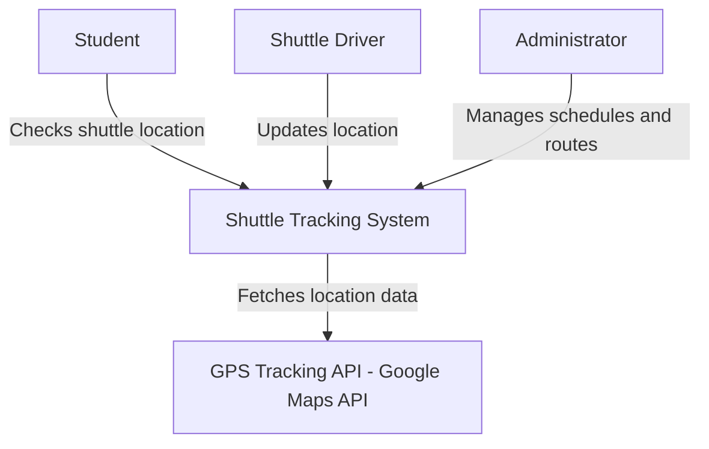
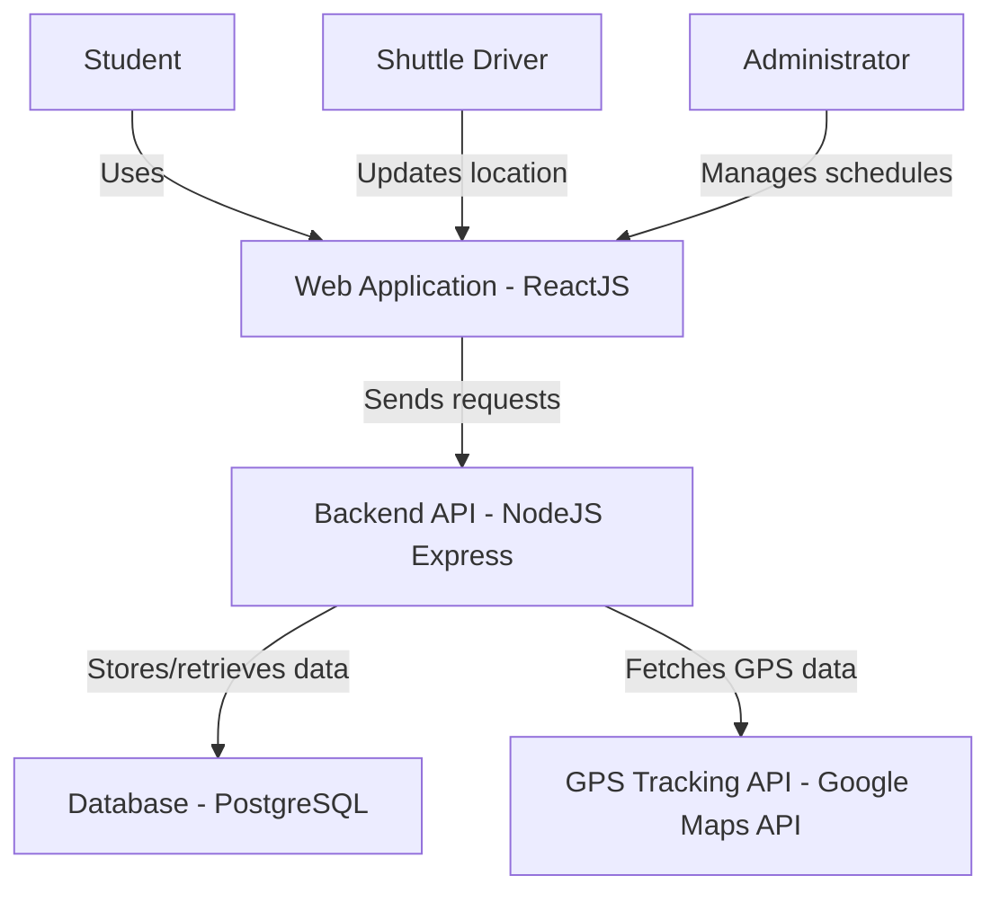
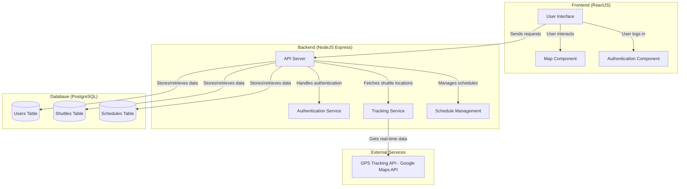

# ARCHITECTURE.md

## 1. System Overview
The University Shuttle Tracking System is a web-based platform that provides real-time tracking of university shuttle buses, improving transit efficiency and user experience.

## 2. C4 Model Diagrams

### Context Diagram
The Context Diagram provides a high-level overview of how different users interact with the system.

### Container Diagram
The Container Diagram breaks down the system into frontend, backend, database, and external services.

### Component Diagram
The Component Diagram provides a more detailed breakdown of internal system modules.

## 3. Technology Stack
Since this is an architectural design, the following technologies are proposed:
- Frontend: React.js
- Backend: Node.js with Express
- Database: PostgreSQL
- GPS Tracking API: Google Maps API
- Deployment: AWS or Firebase

## 4. Deployment Strategy
This system is intended to be cloud-hosted for scalability and reliability. Possible hosting solutions include AWS, Firebase, or DigitalOcean.

