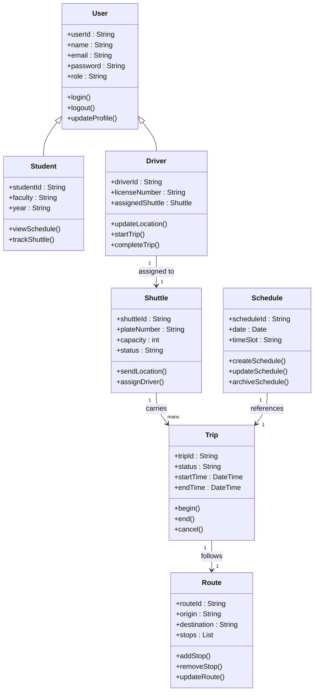

# UML Class Diagram – University Shuttle Tracking Web App

This diagram visualizes the main classes in the shuttle tracking system, their attributes, methods, and relationships.

```mermaid
classDiagram
    class User {
        +userId : String
        +name : String
        +email : String
        +password : String
        +role : String
        +login()
        +logout()
        +updateProfile()
    }

    class Student {
        +studentId : String
        +faculty : String
        +year : String
        +viewSchedule()
        +trackShuttle()
    }

    class Driver {
        +driverId : String
        +licenseNumber : String
        +assignedShuttle : Shuttle
        +updateLocation()
        +startTrip()
        +completeTrip()
    }

    class Shuttle {
        +shuttleId : String
        +plateNumber : String
        +capacity : int
        +status : String
        +sendLocation()
        +assignDriver()
    }

    class Trip {
        +tripId : String
        +status : String
        +startTime : DateTime
        +endTime : DateTime
        +begin()
        +end()
        +cancel()
    }

    class Schedule {
        +scheduleId : String
        +date : Date
        +timeSlot : String
        +createSchedule()
        +updateSchedule()
        +archiveSchedule()
    }

    class Route {
        +routeId : String
        +origin : String
        +destination : String
        +stops : List
        +addStop()
        +removeStop()
        +updateRoute()
    }

    User <|-- Student
    User <|-- Driver
    Shuttle "1" --> "many" Trip : carries
    Driver "1" --> "1" Shuttle : assigned to
    Trip "1" --> "1" Route : follows
    Schedule "1" --> "1" Trip : references
```

---
