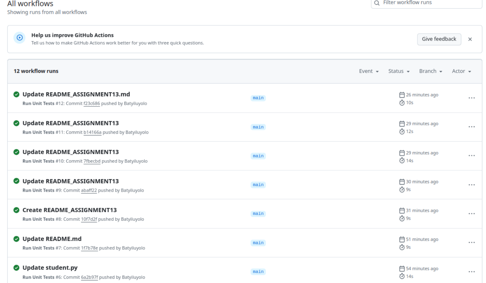

# Assignment 13 – CI/CD with GitHub Actions

This document describes the CI/CD setup implemented for the University Shuttle Tracking System using GitHub Actions.

---

## Continuous Integration (CI)

This project uses **GitHub Actions** to run automated tests on every push and pull request to the `main` branch.

### CI Configuration
- Configured in: `.github/workflows/ci.yml`
- Tests run using: `python -m unittest discover tests/`
- Python version: `3.10`

---

## How to Trigger CI

- Push any change to the `main` branch
- Example: editing `README.md` or pushing a code file

---

## Screenshot: Passing CI Workflow

This screenshot shows a successful GitHub Actions run where all unit tests passed after pushing to the `main` branch.

---

## Status Badge

---

Prepared by: **Luyolo Batyi**
