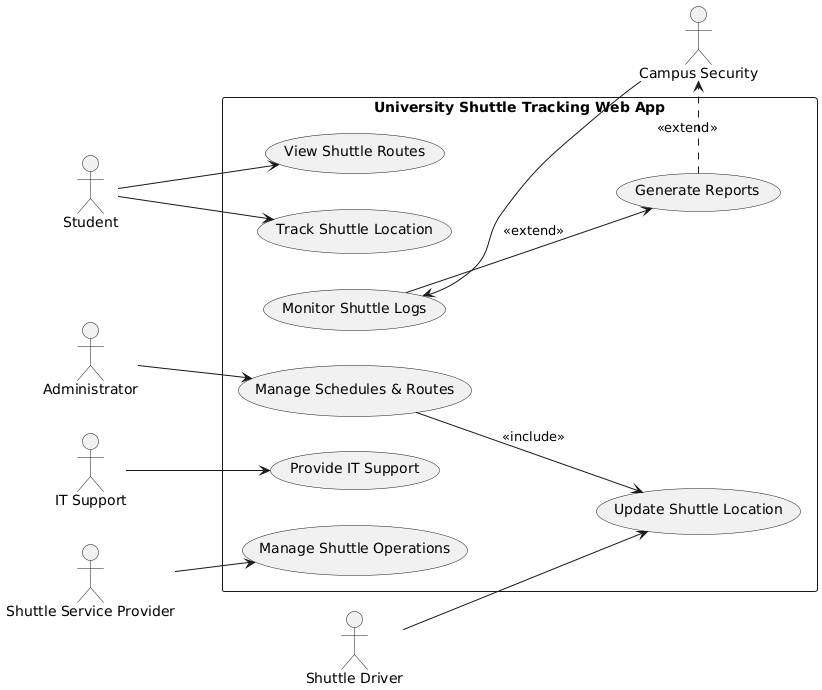

# Use Case Diagram - CPUT Shuttle Tracking Web App  

## 📌 Use Case Diagram (Image)  
  

## 📌 Written Explanation  

### **1. Key Actors and Their Roles**  
- **Student** → Tracks shuttle locations and views routes.  
- **Shuttle Driver** → Updates the shuttle’s real-time location.  
- **Administrator** → Manages schedules and routes.  
- **Campus Security** → Monitors shuttle logs for safety.  
- **IT Support** → Ensures the system runs smoothly.  
- **Shuttle Service Provider** → Oversees overall shuttle operations.  

---

### **2. Relationships Between Actors and Use Cases**  
- **"Manage Schedules & Routes" `<<includes>>` "Update Shuttle Location"** → Because updating routes requires location updates.  
- **"Monitor Shuttle Logs" `<<extends>>` "Generate Reports"** → Because security may sometimes need reports but not always.  

---

### **3. How the Diagram Addresses Stakeholder Concerns**  
- **Students & Drivers** → Can track shuttles in real-time.  
- **Admins** → Can manage routes and schedules easily.  
- **Security** → Can monitor shuttles for safety.  
- **IT Team** → Can maintain system reliability.  
