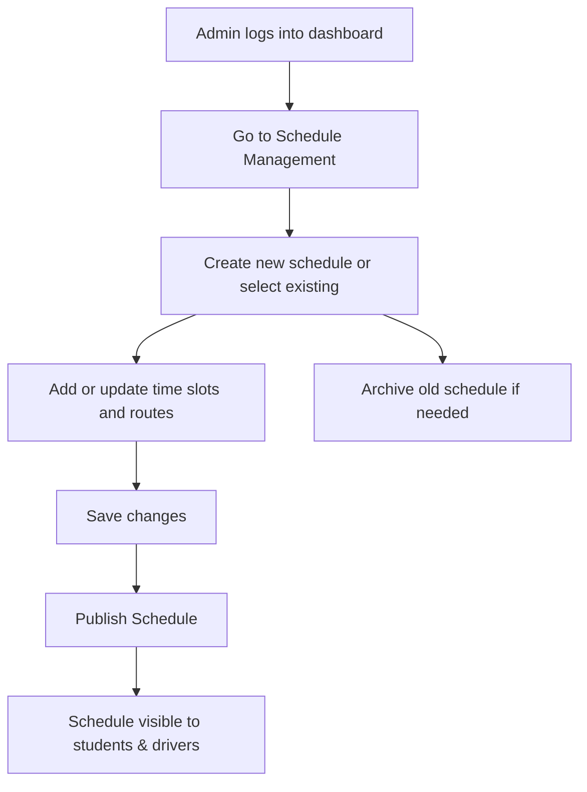

---

## 🗓️ 3. Activity Diagram – Administrator Manages Shuttle Schedule

### 🎯 Scenario: An administrator creates or updates a shuttle schedule.

---

### 📝 Explanation

This activity diagram represents how an administrator manages shuttle schedules through the web app dashboard.  
Admins can create or modify schedules, save changes, and publish them for public viewing.  
They also have the option to archive outdated schedules for future reference or cleanup.

This flow supports efficient schedule maintenance and system transparency.

---

### 🔗 Related Functional Requirements / User Stories / Sprint Tasks

- **FR10** – The system shall allow administrators to create and update schedules.  
- **FR11** – The system shall archive old schedules for reference.  
- **User Story US8** – As an Administrator, I want to manage shuttle schedules so that users receive accurate info.  
- **Sprint Task T1-11** – Create scheduling interface and draft state.  
- **Sprint Task T1-12** – Implement publishing, updating, and archiving functions.

---

✅ *Diagram by: **Luyolo Batyi***
