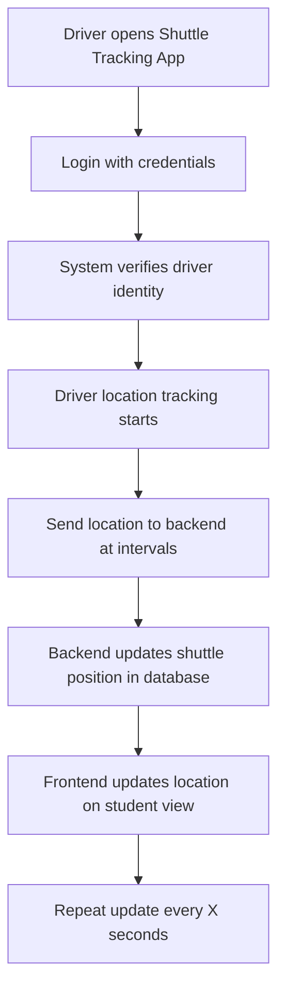

---

## 🚐 2. Activity Diagram – Driver Updates Shuttle Location

### 🎯 Scenario: A driver logs in and the system tracks their GPS location periodically.

---

### 📝 Explanation

This activity captures how the driver interacts with the shuttle system to enable location tracking.  
Upon successful login, the app initiates real-time GPS tracking and sends coordinates at regular intervals to the backend.  
The backend processes the data and updates the student view on the map interface.

This flow is essential for maintaining live shuttle visibility.

---

### 🔗 Related Functional Requirements / User Stories / Sprint Tasks

- **FR4** – The driver shall update their shuttle status and location.  
- **FR2** – The system shall track and display shuttle live location.  
- **User Story US3** – As a Shuttle Driver, I want to update my location easily so that students receive accurate information.  
- **Sprint Task T1-02** – Implement GPS API to fetch shuttle location.  
- **Sprint Task T1-08** – Setup driver-side GPS updates.

---

✅ *Diagram by: **Luyolo Batyi***
