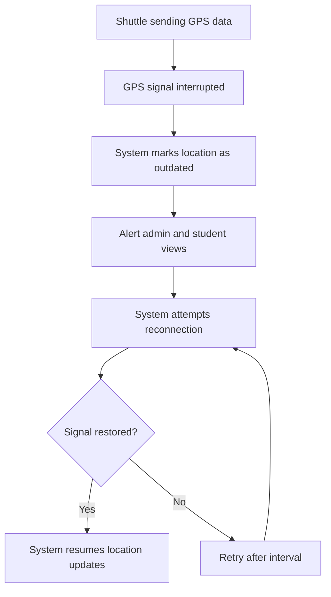

---

## 📡 7. Activity Diagram – GPS Signal Lost and Recovered

### 🎯 Scenario: The shuttle temporarily loses GPS signal and then regains connection.

---

### 📝 Explanation

This activity shows how the system handles GPS signal loss and recovery.  
When signal drops, the shuttle is flagged as outdated and alerts are raised.  
The system keeps trying to reconnect until the signal is restored and updates resume.

This ensures reliability and resilience in live tracking.

---

### 🔗 Related Functional Requirements / User Stories / Sprint Tasks

- **FR13** – The system shall detect and display GPS signal issues.  
- **FR2** – The system shall resume location updates after reconnection.  
- **User Story US5** – As a Student, I want to know when tracking data is outdated.  
- **Sprint Task T1-15** – Implement GPS signal monitoring and alerts.  
- **Sprint Task T1-16** – Retry GPS recovery and resume updates.

---

✅ *Diagram by: **Luyolo Batyi***
