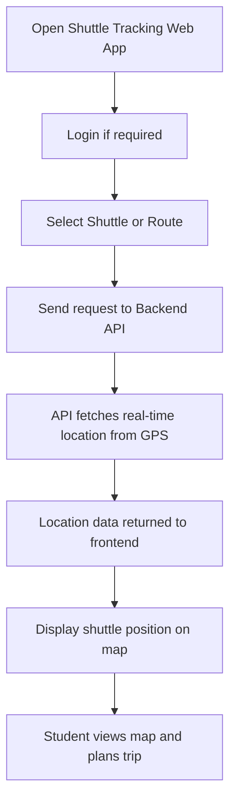

---

## 🧭 1. Activity Diagram – Student Checks Shuttle Location

### 🎯 Scenario: A student opens the web app to view the shuttle's real-time position and route.

---

### 📝 Explanation

This activity represents the student’s flow from accessing the shuttle web app to successfully viewing a live shuttle location on the map.  
The process includes selecting a route, requesting GPS data from the backend, and displaying that data in real-time.

This interaction supports the student's need to plan efficiently by offering up-to-date shuttle visibility.

---

### 🔗 Related Functional Requirements / User Stories / Sprint Tasks

- **FR2** – The system shall track and display the shuttle’s live location.  
- **FR3** – The system shall allow students to select a shuttle or route.  
- **User Story US1** – As a Student, I want to track shuttle locations in real-time so I can plan accordingly.  
- **Sprint Task T1-02** – Implement GPS API to fetch shuttle location.  
- **Sprint Task T1-03** – Display shuttle position on map.

---

✅ *Diagram by: **Luyolo Batyi***
