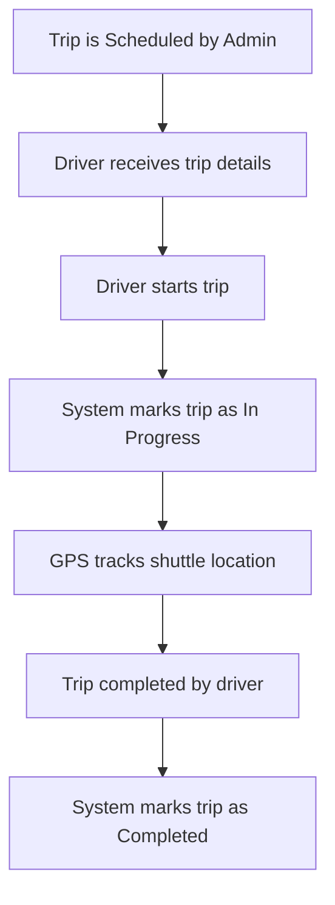

---

## 🚌 5. Activity Diagram – Shuttle Trip Lifecycle

### 🎯 Scenario: A scheduled trip is initiated by the driver and completed once the route ends.

---

### 📝 Explanation

This diagram outlines the key actions involved in a shuttle trip.  
It starts when a trip is scheduled by the admin and proceeds through driver actions and system state updates.  
GPS data is continuously tracked, and the trip is marked as completed once the destination is reached.

This ensures an accurate and reliable trip monitoring process.

---

### 🔗 Related Functional Requirements / User Stories / Sprint Tasks

- **FR5** – The system shall manage shuttle trip lifecycle.  
- **FR2** – The system shall track shuttle location during trips.  
- **User Story US2** – As an Admin, I want to monitor trip progress so I can ensure service delivery.  
- **Sprint Task T1-05** – Implement trip creation and assignment.  
- **Sprint Task T1-06** – Enable status updates during trip lifecycle.

---

✅ *Diagram by: **Luyolo Batyi***
