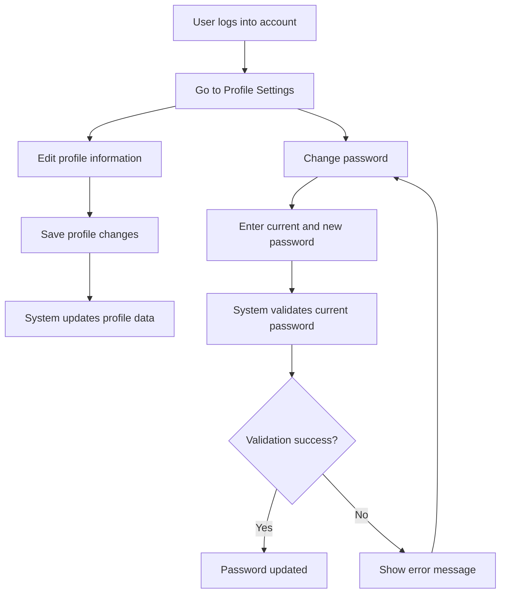

---

## 👤 8. Activity Diagram – User Manages Their Account

### 🎯 Scenario: A user updates their profile details and changes their password.

---

### 📝 Explanation

This activity shows how users manage their account settings.  
They can update personal details or change their password.  
The system performs validation before saving, and notifies the user of success or failure.

This supports account security and personalization features.

---

### 🔗 Related Functional Requirements / User Stories / Sprint Tasks

- **FR8** – The system shall allow users to update account details.  
- **FR9** – The system shall allow users to change their password securely.  
- **User Story US7** – As a User, I want to manage my account so that my information is accurate.  
- **Sprint Task T1-09** – Implement profile and password management interface.

---

✅ *Diagram by: **Luyolo Batyi***
