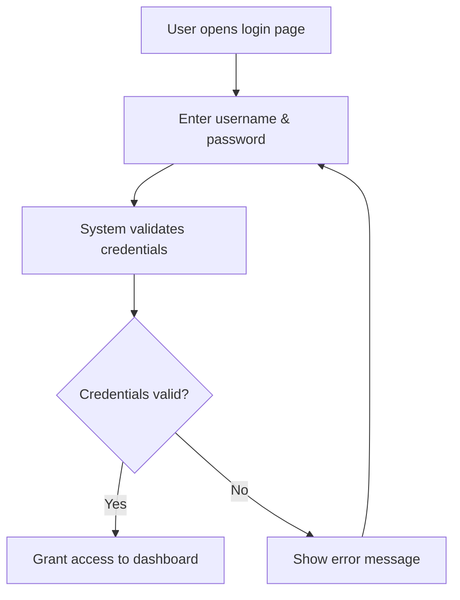

---

## 🔐 4. Activity Diagram – User Logs Into the System

### 🎯 Scenario: A user accesses the shuttle tracking system by logging in securely.

---

### 📝 Explanation

This activity diagram shows the login flow for a system user.  
Users provide their credentials, and the system validates them.  
If valid, access is granted. If not, an error is shown and the user can retry.

This flow ensures secure access control and user verification.

---

### 🔗 Related Functional Requirements / User Stories / Sprint Tasks

- **FR1** – The system shall authenticate all users before access.  
- **User Story US11** – As a User, I want to log in securely so that I can access features meant for me.  
- **Sprint Task T1-01** – Implement user login form and backend authentication.

---

✅ *Diagram by: **Luyolo Batyi***
