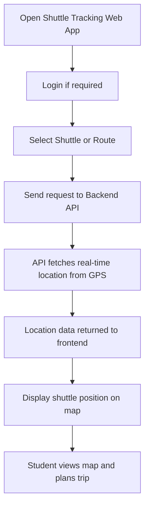
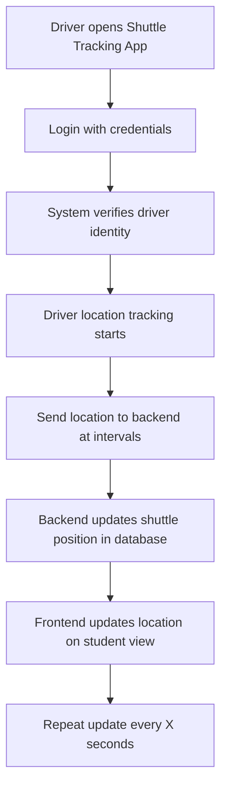
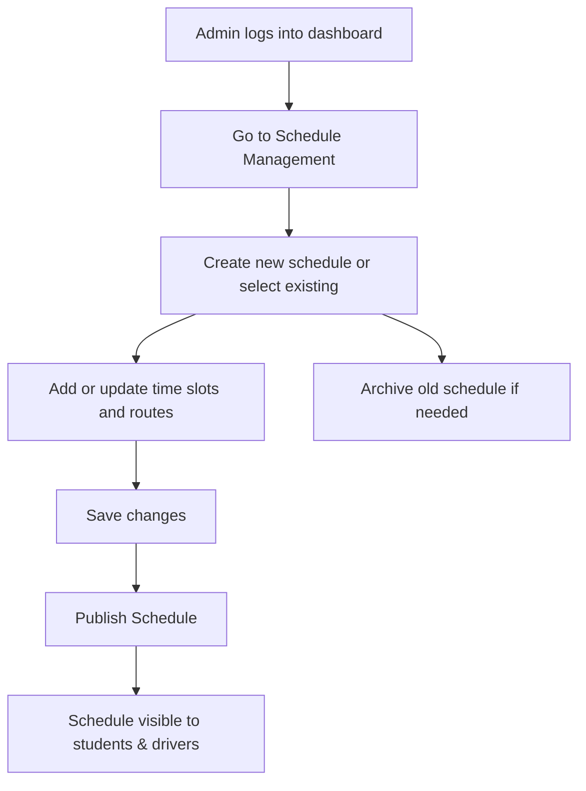
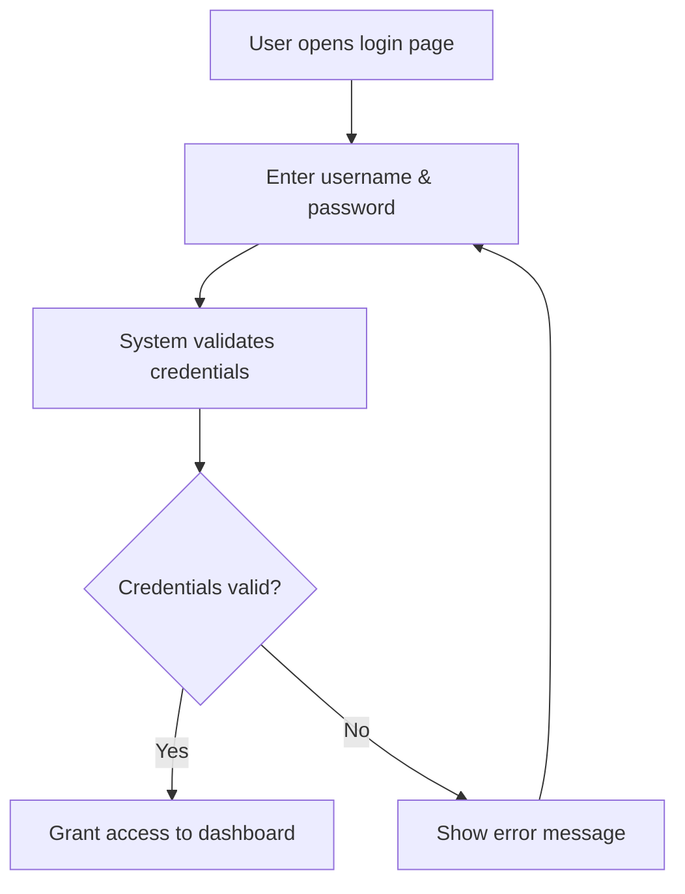
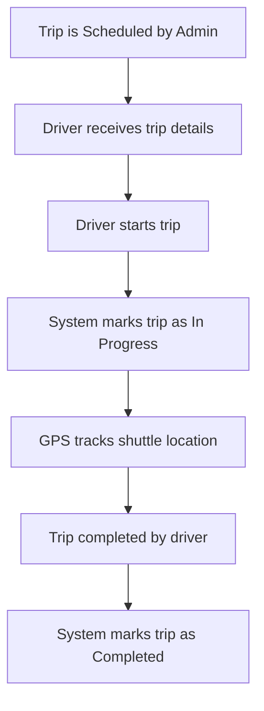
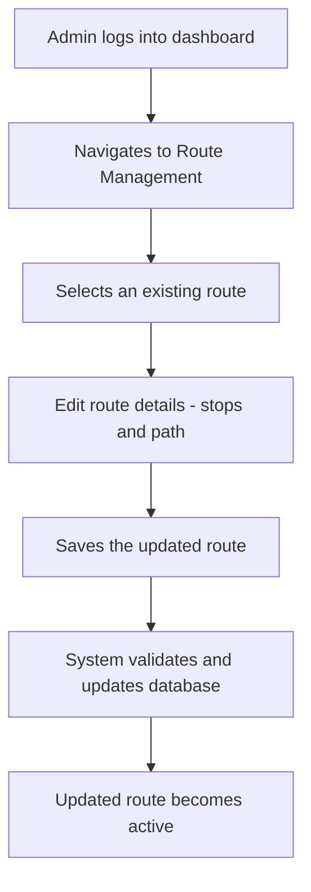
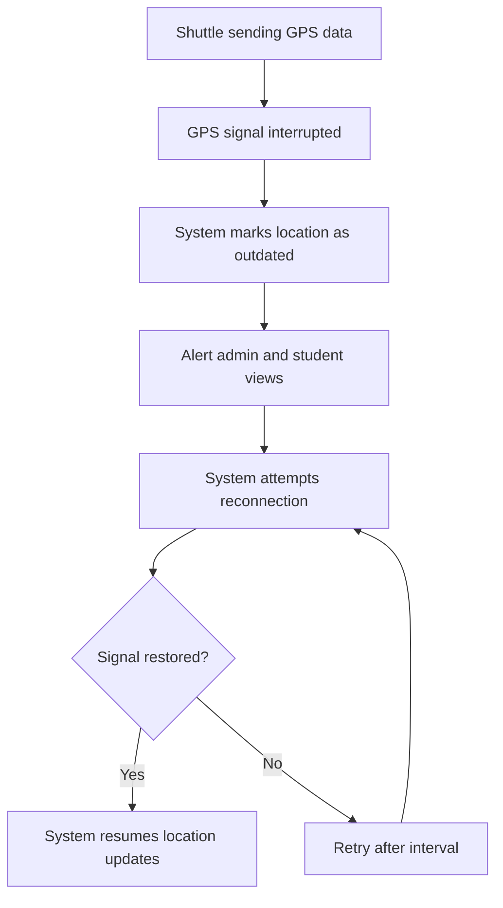
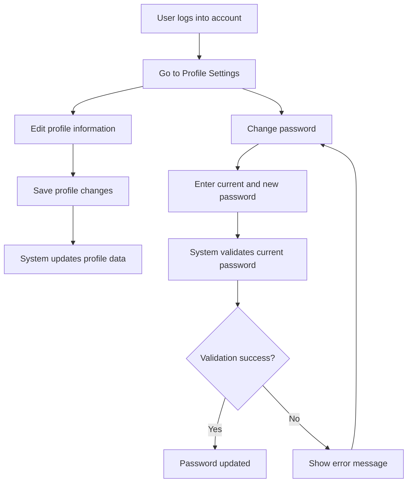

---

## 1. Activity Diagram – Student Checks Shuttle Location

### Scenario: A student opens the web app to view the shuttle's real-time position and route.

---

### Explanation

This activity represents the student’s flow from accessing the shuttle web app to successfully viewing a live shuttle location on the map.  
The process includes selecting a route, requesting GPS data from the backend, and displaying that data in real-time.

This interaction supports the student's need to plan efficiently by offering up-to-date shuttle visibility.

---

### Related Functional Requirements / User Stories / Sprint Tasks

- **FR2** – The system shall track and display the shuttle’s live location.  
- **FR3** – The system shall allow students to select a shuttle or route.  
- **User Story US1** – As a Student, I want to track shuttle locations in real-time so I can plan accordingly.  
- **Sprint Task T1-02** – Implement GPS API to fetch shuttle location.  
- **Sprint Task T1-03** – Display shuttle position on map.

---

---

## 2. Activity Diagram – Driver Updates Shuttle Location

### Scenario: A driver logs in and the system tracks their GPS location periodically.

---

### Explanation

This activity captures how the driver interacts with the shuttle system to enable location tracking.  
Upon successful login, the app initiates real-time GPS tracking and sends coordinates at regular intervals to the backend.  
The backend processes the data and updates the student view on the map interface.

This flow is essential for maintaining live shuttle visibility.

---

### Related Functional Requirements / User Stories / Sprint Tasks

- **FR4** – The driver shall update their shuttle status and location.  
- **FR2** – The system shall track and display shuttle live location.  
- **User Story US3** – As a Shuttle Driver, I want to update my location easily so that students receive accurate information.  
- **Sprint Task T1-02** – Implement GPS API to fetch shuttle location.  
- **Sprint Task T1-08** – Setup driver-side GPS updates.

---

---

## 3. Activity Diagram – Administrator Manages Shuttle Schedule

### Scenario: An administrator creates or updates a shuttle schedule.

---

### Explanation

This activity diagram represents how an administrator manages shuttle schedules through the web app dashboard.  
Admins can create or modify schedules, save changes, and publish them for public viewing.  
They also have the option to archive outdated schedules for future reference or cleanup.

This flow supports efficient schedule maintenance and system transparency.

---

### Related Functional Requirements / User Stories / Sprint Tasks

- **FR10** – The system shall allow administrators to create and update schedules.  
- **FR11** – The system shall archive old schedules for reference.  
- **User Story US8** – As an Administrator, I want to manage shuttle schedules so that users receive accurate info.  
- **Sprint Task T1-11** – Create scheduling interface and draft state.  
- **Sprint Task T1-12** – Implement publishing, updating, and archiving functions.

---

---

## 4. Activity Diagram – User Logs Into the System

### Scenario: A user accesses the shuttle tracking system by logging in securely.

---

### Explanation

This activity diagram shows the login flow for a system user.  
Users provide their credentials, and the system validates them.  
If valid, access is granted. If not, an error is shown and the user can retry.

This flow ensures secure access control and user verification.

---

### Related Functional Requirements / User Stories / Sprint Tasks

- **FR1** – The system shall authenticate all users before access.  
- **User Story US11** – As a User, I want to log in securely so that I can access features meant for me.  
- **Sprint Task T1-01** – Implement user login form and backend authentication.

---

---

## 5. Activity Diagram – Shuttle Trip Lifecycle

### Scenario: A scheduled trip is initiated by the driver and completed once the route ends.

---

### Explanation

This diagram outlines the key actions involved in a shuttle trip.  
It starts when a trip is scheduled by the admin and proceeds through driver actions and system state updates.  
GPS data is continuously tracked, and the trip is marked as completed once the destination is reached.

This ensures an accurate and reliable trip monitoring process.

---

### Related Functional Requirements / User Stories / Sprint Tasks

- **FR5** – The system shall manage shuttle trip lifecycle.  
- **FR2** – The system shall track shuttle location during trips.  
- **User Story US2** – As an Admin, I want to monitor trip progress so I can ensure service delivery.  
- **Sprint Task T1-05** – Implement trip creation and assignment.  
- **Sprint Task T1-06** – Enable status updates during trip lifecycle.

---

---

## 6. Activity Diagram – Admin Updates a Route

### Scenario: An administrator updates an existing shuttle route in the system.

---

### Explanation

This activity outlines how an admin updates a route.  
After selecting an existing route, they make changes such as modifying stops or paths.  
Upon saving, the system updates the route and makes it active for use in schedules.

This process ensures route accuracy and reflects any operational changes.

---

### Related Functional Requirements / User Stories / Sprint Tasks

- **FR12** – The system shall allow admins to update routes.  
- **User Story US10** – As an Administrator, I want to modify routes so I can adapt to operational needs.  
- **Sprint Task T1-14** – Implement route editing interface and backend logic.

---

---

## 7. Activity Diagram – GPS Signal Lost and Recovered

### Scenario: The shuttle temporarily loses GPS signal and then regains connection.

---

### Explanation

This activity shows how the system handles GPS signal loss and recovery.  
When signal drops, the shuttle is flagged as outdated and alerts are raised.  
The system keeps trying to reconnect until the signal is restored and updates resume.

This ensures reliability and resilience in live tracking.

---

### Related Functional Requirements / User Stories / Sprint Tasks

- **FR13** – The system shall detect and display GPS signal issues.  
- **FR2** – The system shall resume location updates after reconnection.  
- **User Story US5** – As a Student, I want to know when tracking data is outdated.  
- **Sprint Task T1-15** – Implement GPS signal monitoring and alerts.  
- **Sprint Task T1-16** – Retry GPS recovery and resume updates.

---

---

## 8. Activity Diagram – User Manages Their Account

### Scenario: A user updates their profile details and changes their password.

---

### Explanation

This activity shows how users manage their account settings.  
They can update personal details or change their password.  
The system performs validation before saving, and notifies the user of success or failure.

This supports account security and personalization features.

---

### Related Functional Requirements / User Stories / Sprint Tasks

- **FR8** – The system shall allow users to update account details.  
- **FR9** – The system shall allow users to change their password securely.  
- **User Story US7** – As a User, I want to manage my account so that my information is accurate.  
- **Sprint Task T1-09** – Implement profile and password management interface.

---

