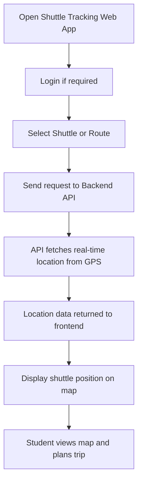
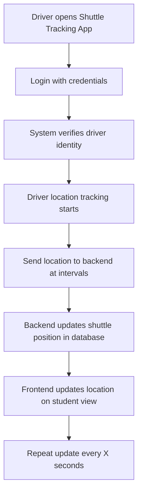
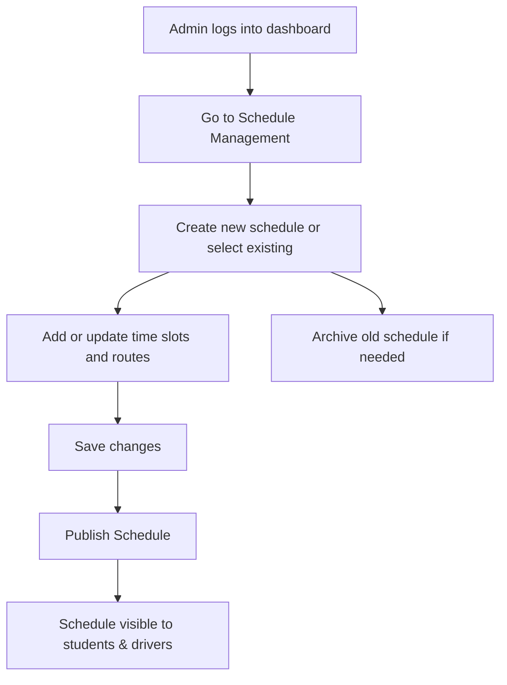

---

## 🧭 1. Activity Diagram – Student Checks Shuttle Location

### 🎯 Scenario: A student opens the web app to view the shuttle's real-time position and route.

---

### 📝 Explanation

This activity represents the student’s flow from accessing the shuttle web app to successfully viewing a live shuttle location on the map.  
The process includes selecting a route, requesting GPS data from the backend, and displaying that data in real-time.

This interaction supports the student's need to plan efficiently by offering up-to-date shuttle visibility.

---

### 🔗 Related Functional Requirements / User Stories / Sprint Tasks

- **FR2** – The system shall track and display the shuttle’s live location.  
- **FR3** – The system shall allow students to select a shuttle or route.  
- **User Story US1** – As a Student, I want to track shuttle locations in real-time so I can plan accordingly.  
- **Sprint Task T1-02** – Implement GPS API to fetch shuttle location.  
- **Sprint Task T1-03** – Display shuttle position on map.

---

---

## 🚐 2. Activity Diagram – Driver Updates Shuttle Location

### 🎯 Scenario: A driver logs in and the system tracks their GPS location periodically.

---

### 📝 Explanation

This activity captures how the driver interacts with the shuttle system to enable location tracking.  
Upon successful login, the app initiates real-time GPS tracking and sends coordinates at regular intervals to the backend.  
The backend processes the data and updates the student view on the map interface.

This flow is essential for maintaining live shuttle visibility.

---

### 🔗 Related Functional Requirements / User Stories / Sprint Tasks

- **FR4** – The driver shall update their shuttle status and location.  
- **FR2** – The system shall track and display shuttle live location.  
- **User Story US3** – As a Shuttle Driver, I want to update my location easily so that students receive accurate information.  
- **Sprint Task T1-02** – Implement GPS API to fetch shuttle location.  
- **Sprint Task T1-08** – Setup driver-side GPS updates.

---

---

## 🗓️ 3. Activity Diagram – Administrator Manages Shuttle Schedule

### 🎯 Scenario: An administrator creates or updates a shuttle schedule.

---

### 📝 Explanation

This activity diagram represents how an administrator manages shuttle schedules through the web app dashboard.  
Admins can create or modify schedules, save changes, and publish them for public viewing.  
They also have the option to archive outdated schedules for future reference or cleanup.

This flow supports efficient schedule maintenance and system transparency.

---

### 🔗 Related Functional Requirements / User Stories / Sprint Tasks

- **FR10** – The system shall allow administrators to create and update schedules.  
- **FR11** – The system shall archive old schedules for reference.  
- **User Story US8** – As an Administrator, I want to manage shuttle schedules so that users receive accurate info.  
- **Sprint Task T1-11** – Create scheduling interface and draft state.  
- **Sprint Task T1-12** – Implement publishing, updating, and archiving functions.

---

