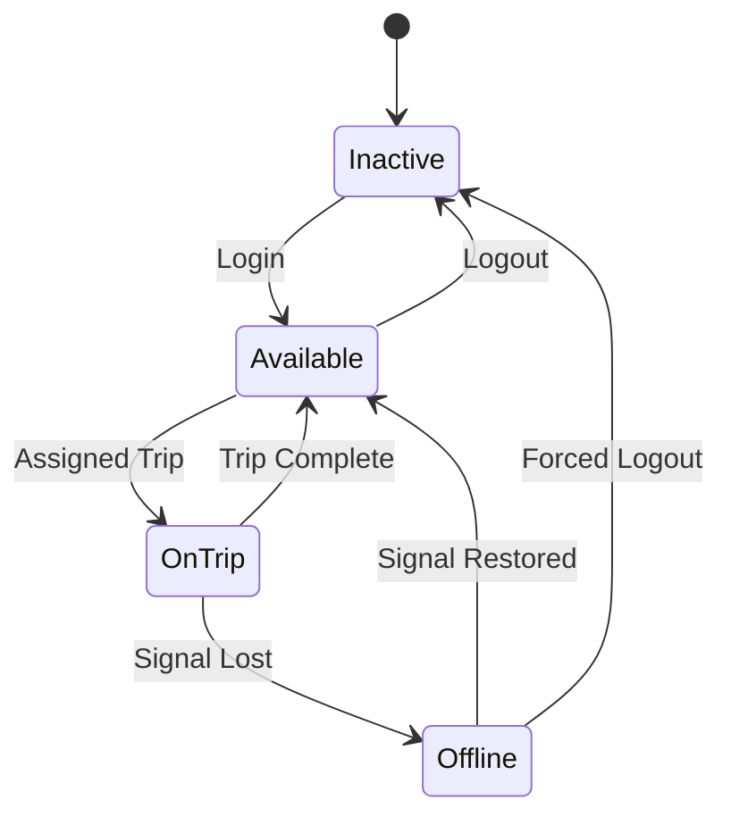

---

## 🧑‍✈️ 3. State Transition Diagram – Driver

### 🎯 Object: Driver

This state diagram represents how a shuttle driver’s system state changes during login, trip assignment, and logout phases.

### 📝 Explanation

A Driver begins in the **Inactive** state when logged out.  
When they log in, they become **Available** to take on a trip.  
Upon assignment, they enter the **On Trip** state.  
Once a trip is finished, they return to **Available**.

Drivers can also go **Offline** unexpectedly due to connection issues.  
When the signal is restored, they become **Available** again, or **Inactive** if forcibly logged out.

This state model helps the system reflect accurate driver availability and reliability during operations.

---

### 🔗 Related Functional Requirements / User Stories / Sprint Tasks

FR6 – The system shall allow drivers to update their trip status.  
FR7 – The system shall detect driver connection status.  
User Story US3 – As a Shuttle Driver, I want to update my trip status so that the system reflects real-time info.  
User Story US5 – As an Administrator, I want to monitor driver availability for scheduling.  
Sprint Task T1-07 – Driver login/logout handling.  
Sprint Task T1-08 – Handle driver disconnection and reconnection states.

---

✅ *Diagram by: **Luyolo Batyi***
