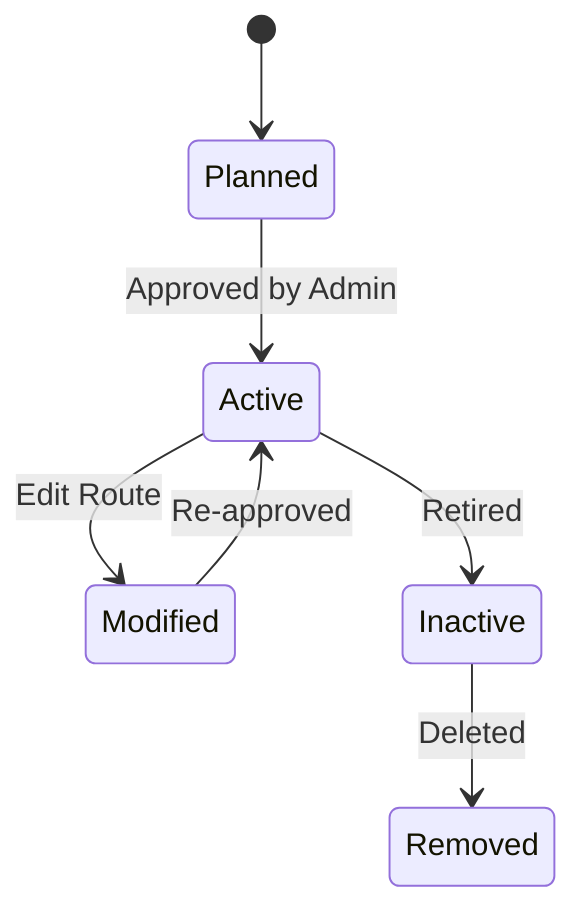

---

## 🗺️ 6. State Transition Diagram – Route

### 🎯 Object: Route

This state diagram outlines how a shuttle route evolves from creation to possible removal from the system.

### 📝 Explanation

A Route starts in the **Planned** state when first designed.  
Once approved, it becomes **Active** and available for use in scheduling.  
If adjustments are made, it moves to **Modified**, and must be **Re-approved** to be used again.  
Outdated routes are marked **Inactive**, and may later be **Removed** from the system.

This model supports flexible updates to accommodate changing shuttle needs.

---

### 🔗 Related Functional Requirements / User Stories / Sprint Tasks

FR12 – The system shall manage the creation, editing, and deactivation of routes.  
User Story US10 – As an Administrator, I want to manage routes so I can optimize travel across campus.  
Sprint Task T1-13 – Design route management interface.  
Sprint Task T1-14 – Implement state tracking and approvals for route changes.

---

✅ *Diagram by: **Luyolo Batyi***
