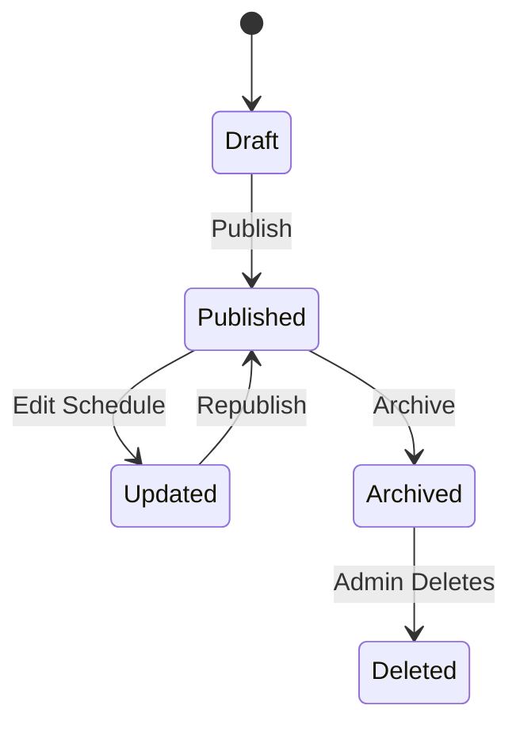

---

## 📅 5. State Transition Diagram – Schedule

### 🎯 Object: Schedule

This state diagram represents how shuttle schedules move through different phases from creation to archival or deletion.

### 📝 Explanation

A Schedule starts in the **Draft** state when it's first created.  
Once finalized, it becomes **Published** and visible to users.  
If modified later, it enters an **Updated** state and must be **Republished**.  
Schedules not in use anymore move to **Archived**.  
Admins may eventually **Delete** archived schedules.

This diagram supports maintaining up-to-date and organized shuttle operations.

---

### 🔗 Related Functional Requirements / User Stories / Sprint Tasks

FR10 – The system shall allow administrators to create and update schedules.  
FR11 – The system shall archive old schedules for reference.  
User Story US8 – As an Administrator, I want to manage shuttle schedules so that users receive accurate info.  
User Story US9 – As a Student, I want to see current schedules without confusion.  
Sprint Task T1-11 – Create scheduling interface and draft state.  
Sprint Task T1-12 – Implement publishing, updating, and archiving functions.

---

✅ *Diagram by: **Luyolo Batyi***
