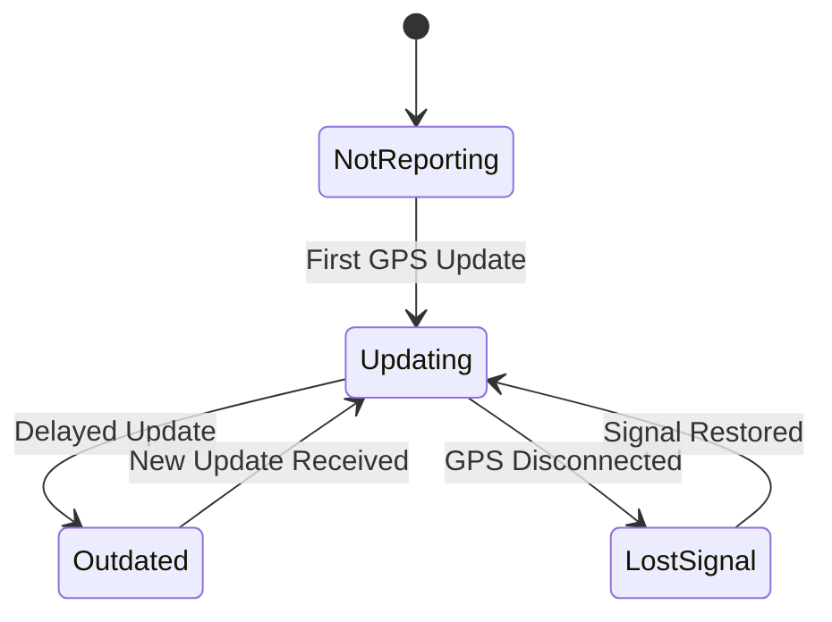

---

## 📍 7. State Transition Diagram – Shuttle Location

### 🎯 Object: Shuttle Location

This state diagram represents the real-time status of shuttle location reporting in the system.

### 📝 Explanation

The **Shuttle Location** starts in the **Not Reporting** state when the system has no data.  
Once a GPS signal is received, it moves to **Updating**.  
If updates stop for a while, it becomes **Outdated**.  
Once a new update comes in, it returns to **Updating**.

If the GPS signal is lost entirely, the state changes to **Lost Signal**, and returns to **Updating** once reconnected.

This model ensures accurate handling of real-time and interrupted GPS data streams.

---

### 🔗 Related Functional Requirements / User Stories / Sprint Tasks

FR2 – The system shall track the shuttle’s live location.  
FR13 – The system shall detect and display signal status.  
User Story US1 – As a Student, I want to track shuttle locations in real-time so I can plan accordingly.  
Sprint Task T1-15 – Handle GPS signal loss and recovery.  
Sprint Task T1-16 – Flag and display outdated location data.

---

✅ *Diagram by: **Luyolo Batyi***
