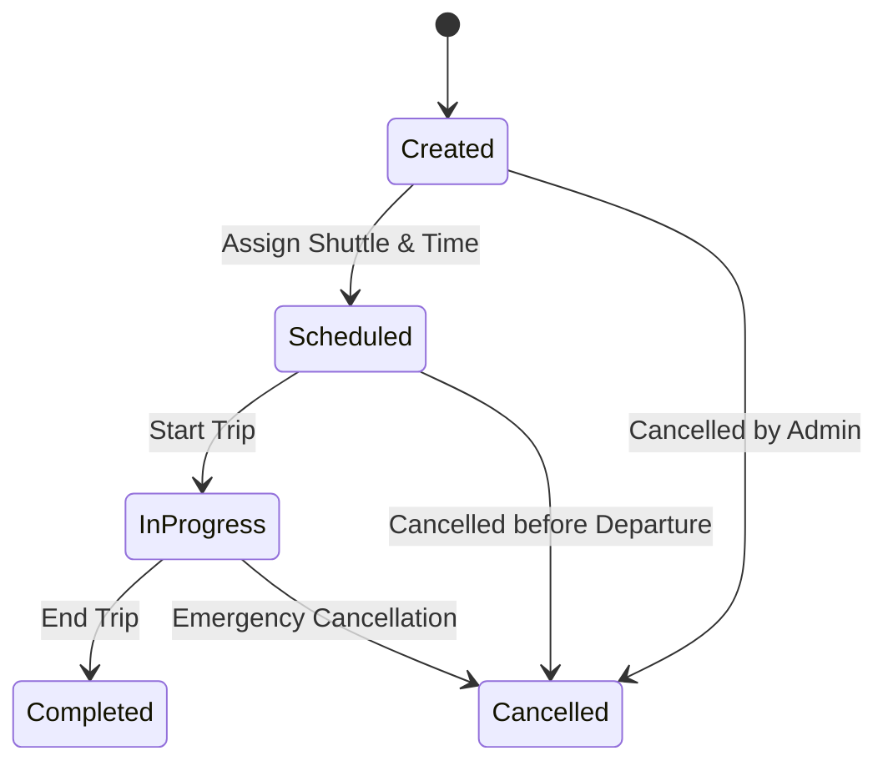

---

## 🧾 2. State Transition Diagram – Trip

### 🎯 Object: Trip

This state diagram shows the lifecycle of a Trip within the University Shuttle Tracking Web App.

### 📝 Explanation

A Trip starts in the Created state when an admin or system schedules a new route.  
Once a time and shuttle are assigned, it moves to Scheduled.  
When the shuttle begins transport, the trip transitions to In Progress.  
If everything goes well, it ends in Completed.  

However, trips may be Cancelled at any point before or during execution depending on admin decisions or emergencies.  

This model ensures the system properly tracks trip creation, scheduling, and cancellation scenarios.

---

### 🔗 Related Functional Requirements / User Stories / Sprint Tasks

FR5 – The system shall allow administrators to schedule and cancel trips.  
User Story US2 – As an Administrator, I want to manage shuttle trips so that I can coordinate transport efficiently.  
User Story US4 – As a Student, I want accurate trip info so I can plan my travel.  
Sprint Task T1-05 – Develop trip creation and scheduling interface.  
Sprint Task T1-06 – Implement trip lifecycle state tracking.

---

✅ *Diagram by: **Luyolo Batyi***
