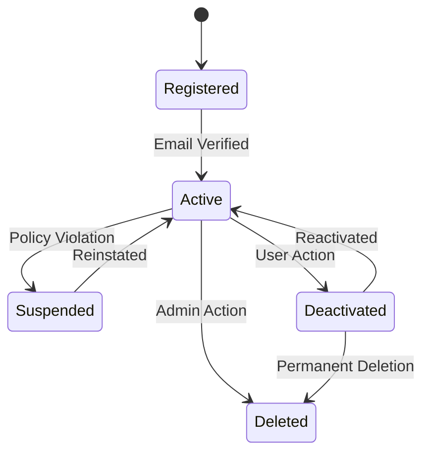

---

## 👤 4. State Transition Diagram – User Account

### 🎯 Object: User Account

This state diagram outlines the lifecycle of a user's account from registration to potential deactivation or deletion.

### 📝 Explanation

A User Account begins in the **Registered** state after signing up.  
Once the email is verified, the account becomes **Active**.  
If a violation occurs, it may be **Suspended** and later **Reinstated**.  
Users can **Deactivate** their own accounts, with the option to **Reactivate**.

Accounts may be **Deleted** either by admin decision or permanently by the user.  
This flow ensures a secure and flexible lifecycle for all system users.

---

### 🔗 Related Functional Requirements / User Stories / Sprint Tasks

FR8 – The system shall manage user registration and verification.  
FR9 – The system shall allow users to deactivate or delete their accounts.  
User Story US6 – As a Student, I want to manage my account so I can maintain privacy and security.  
User Story US7 – As an Admin, I want to suspend or delete abusive accounts.  
Sprint Task T1-09 – Implement account verification and status management.  
Sprint Task T1-10 – Develop user account deactivation and deletion process.

---

✅ *Diagram by: **Luyolo Batyi***
