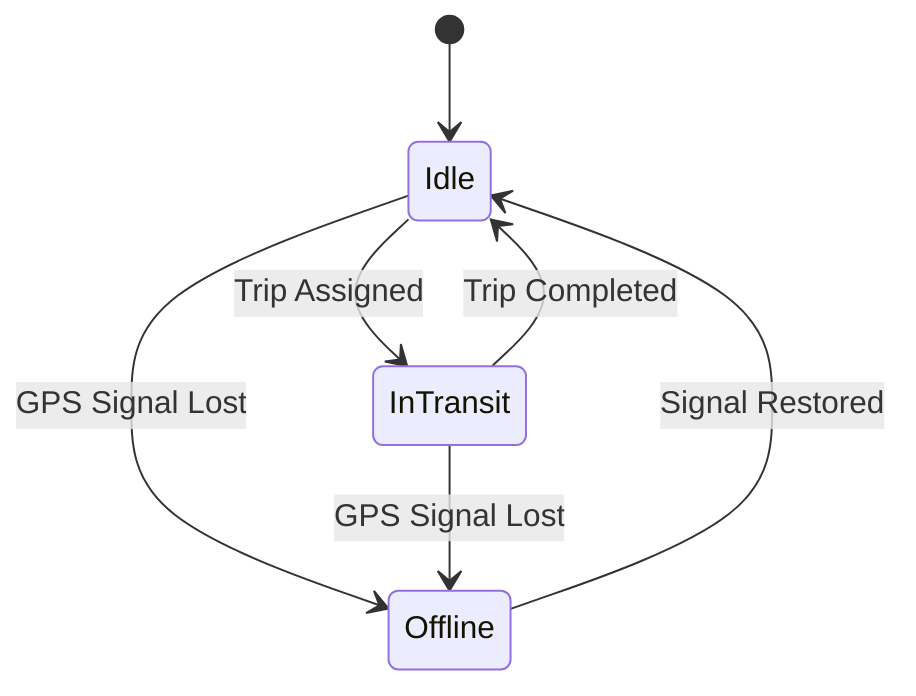
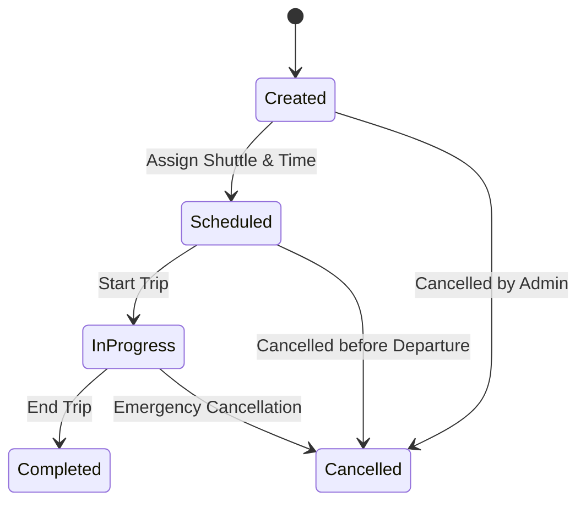
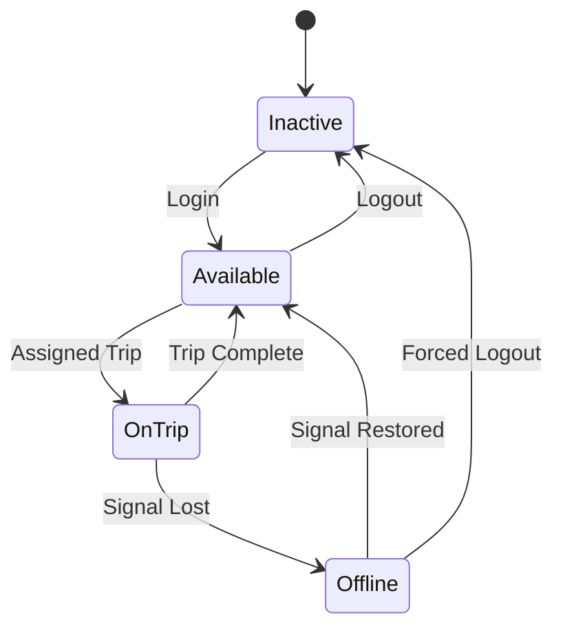
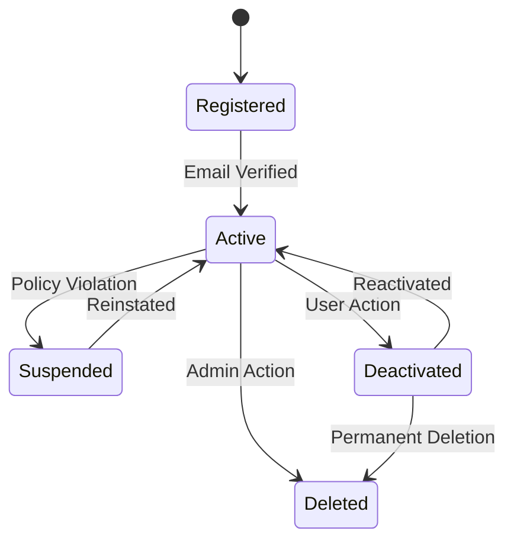
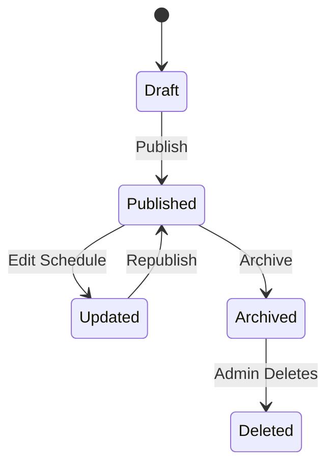
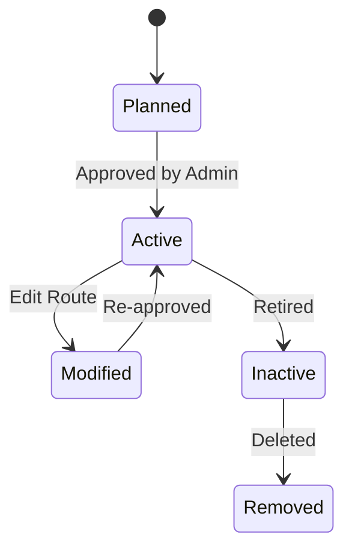
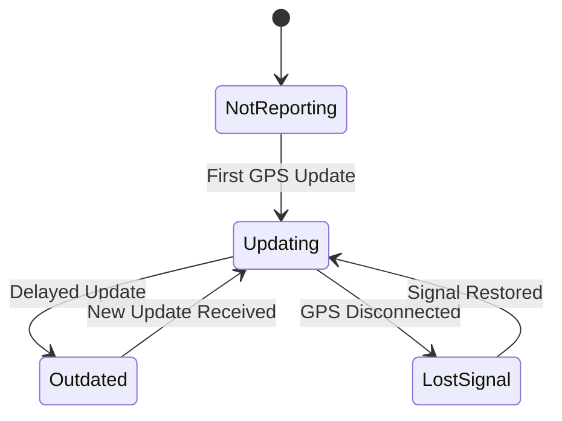

# State Transition Diagrams – University Shuttle Tracking Web App

This document includes state diagrams for key objects in the system, each followed by:

- Explanation of the object’s state changes  
- Related functional requirements, user stories, and sprint tasks

---

## 1. State Transition Diagram – Shuttle

### Object: Shuttle

This state diagram shows the lifecycle of a shuttle during its operation in the University Shuttle Tracking Web App.

---

### Explanation

The Idle state represents a shuttle that is available but not currently transporting passengers.  
When a trip is assigned, the shuttle transitions to the In Transit state.  
Upon completing the trip, the shuttle returns to Idle.  
If at any point the GPS signal is lost, the shuttle enters the Offline state.  
When the signal is restored, the shuttle returns to Idle.  

This state model enables the system to handle live tracking, trip status management, and GPS connectivity issues effectively.

---

### Related Functional Requirements / User Stories / Sprint Tasks

FR2 – The system shall track the shuttle’s live location.  
FR4 – The driver shall update their shuttle status (Idle, In Transit).  
User Story US1 – As a Student, I want to track shuttle locations in real-time so I can plan accordingly.  
User Story US3 – As a Shuttle Driver, I want to update my shuttle’s location easily so that students receive accurate information.  
Sprint Task T1-02 – Implement GPS API to fetch shuttle location.  
Sprint Task T1-03 – Display shuttle position on map.

---
---

## 2. State Transition Diagram – Trip

### Object: Trip

This state diagram shows the lifecycle of a Trip within the University Shuttle Tracking Web App.

---
### Explanation

A Trip starts in the Created state when an admin or system schedules a new route.  
Once a time and shuttle are assigned, it moves to Scheduled.  
When the shuttle begins transport, the trip transitions to In Progress.  
If everything goes well, it ends in Completed.  

However, trips may be Cancelled at any point before or during execution depending on admin decisions or emergencies.  

This model ensures the system properly tracks trip creation, scheduling, and cancellation scenarios.

---

### Related Functional Requirements / User Stories / Sprint Tasks

FR5 – The system shall allow administrators to schedule and cancel trips.  
User Story US2 – As an Administrator, I want to manage shuttle trips so that I can coordinate transport efficiently.  
User Story US4 – As a Student, I want accurate trip info so I can plan my travel.  
Sprint Task T1-05 – Develop trip creation and scheduling interface.  
Sprint Task T1-06 – Implement trip lifecycle state tracking.

---

---

## 3. State Transition Diagram – Driver

### Object: Driver

This state diagram represents how a shuttle driver’s system state changes during login, trip assignment, and logout phases.

### Explanation

A Driver begins in the **Inactive** state when logged out.  
When they log in, they become **Available** to take on a trip.  
Upon assignment, they enter the **On Trip** state.  
Once a trip is finished, they return to **Available**.

Drivers can also go **Offline** unexpectedly due to connection issues.  
When the signal is restored, they become **Available** again, or **Inactive** if forcibly logged out.

This state model helps the system reflect accurate driver availability and reliability during operations.

---

### Related Functional Requirements / User Stories / Sprint Tasks

FR6 – The system shall allow drivers to update their trip status.  
FR7 – The system shall detect driver connection status.  
User Story US3 – As a Shuttle Driver, I want to update my trip status so that the system reflects real-time info.  
User Story US5 – As an Administrator, I want to monitor driver availability for scheduling.  
Sprint Task T1-07 – Driver login/logout handling.  
Sprint Task T1-08 – Handle driver disconnection and reconnection states.

---

---

## 4. State Transition Diagram – User Account

### Object: User Account

This state diagram outlines the lifecycle of a user's account from registration to potential deactivation or deletion.

### Explanation

A User Account begins in the **Registered** state after signing up.  
Once the email is verified, the account becomes **Active**.  
If a violation occurs, it may be **Suspended** and later **Reinstated**.  
Users can **Deactivate** their own accounts, with the option to **Reactivate**.

Accounts may be **Deleted** either by admin decision or permanently by the user.  
This flow ensures a secure and flexible lifecycle for all system users.

---

### Related Functional Requirements / User Stories / Sprint Tasks

FR8 – The system shall manage user registration and verification.  
FR9 – The system shall allow users to deactivate or delete their accounts.  
User Story US6 – As a Student, I want to manage my account so I can maintain privacy and security.  
User Story US7 – As an Admin, I want to suspend or delete abusive accounts.  
Sprint Task T1-09 – Implement account verification and status management.  
Sprint Task T1-10 – Develop user account deactivation and deletion process.

---

---

## 5. State Transition Diagram – Schedule

### Object: Schedule

This state diagram represents how shuttle schedules move through different phases from creation to archival or deletion.

### Explanation

A Schedule starts in the **Draft** state when it's first created.  
Once finalized, it becomes **Published** and visible to users.  
If modified later, it enters an **Updated** state and must be **Republished**.  
Schedules not in use anymore move to **Archived**.  
Admins may eventually **Delete** archived schedules.

This diagram supports maintaining up-to-date and organized shuttle operations.

---

### Related Functional Requirements / User Stories / Sprint Tasks

FR10 – The system shall allow administrators to create and update schedules.  
FR11 – The system shall archive old schedules for reference.  
User Story US8 – As an Administrator, I want to manage shuttle schedules so that users receive accurate info.  
User Story US9 – As a Student, I want to see current schedules without confusion.  
Sprint Task T1-11 – Create scheduling interface and draft state.  
Sprint Task T1-12 – Implement publishing, updating, and archiving functions.

---

---

## 6. State Transition Diagram – Route

### Object: Route

This state diagram outlines how a shuttle route evolves from creation to possible removal from the system.

### Explanation

A Route starts in the **Planned** state when first designed.  
Once approved, it becomes **Active** and available for use in scheduling.  
If adjustments are made, it moves to **Modified**, and must be **Re-approved** to be used again.  
Outdated routes are marked **Inactive**, and may later be **Removed** from the system.

This model supports flexible updates to accommodate changing shuttle needs.

---

### Related Functional Requirements / User Stories / Sprint Tasks

FR12 – The system shall manage the creation, editing, and deactivation of routes.  
User Story US10 – As an Administrator, I want to manage routes so I can optimize travel across campus.  
Sprint Task T1-13 – Design route management interface.  
Sprint Task T1-14 – Implement state tracking and approvals for route changes.

---

---

## 7. State Transition Diagram – Shuttle Location

### Object: Shuttle Location

This state diagram represents the real-time status of shuttle location reporting in the system.

### Explanation

The **Shuttle Location** starts in the **Not Reporting** state when the system has no data.  
Once a GPS signal is received, it moves to **Updating**.  
If updates stop for a while, it becomes **Outdated**.  
Once a new update comes in, it returns to **Updating**.

If the GPS signal is lost entirely, the state changes to **Lost Signal**, and returns to **Updating** once reconnected.

This model ensures accurate handling of real-time and interrupted GPS data streams.

---

### Related Functional Requirements / User Stories / Sprint Tasks

FR2 – The system shall track the shuttle’s live location.  
FR13 – The system shall detect and display signal status.  
User Story US1 – As a Student, I want to track shuttle locations in real-time so I can plan accordingly.  
Sprint Task T1-15 – Handle GPS signal loss and recovery.  
Sprint Task T1-16 – Flag and display outdated location data.

---

